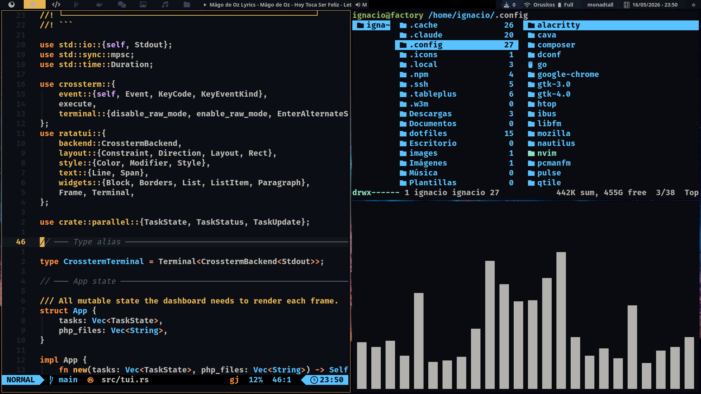
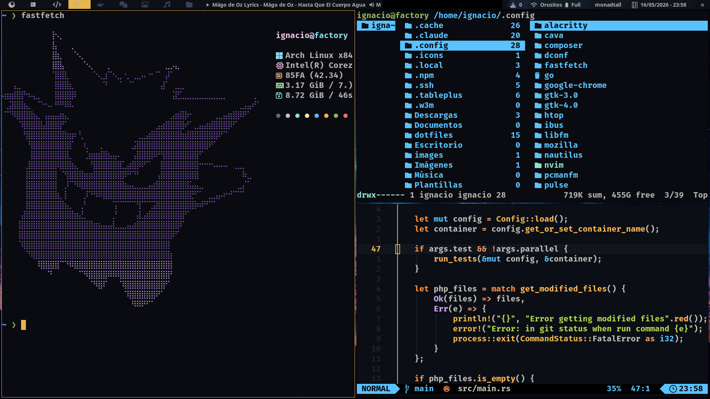

# dotfiles

Configuración personal de entorno de desarrollo para Arch Linux.

***Idioma***
- [🇺🇸 English](./README.md)
- 🇪🇸 Español





## Contenido

| Herramienta | Descripción | Docs |
|-------------|-------------|------|
| [alacritty](./alacritty/alacritty.toml) | Terminal con tema Ayu Dark y JetBrainsMono | — |
| [claude](./claude/settings.json) | Claude Code CLI — plugins caveman, superpowers y frontend-design | [README.md](./claude/README.md) |
| [fastfetch](./fastfetch/config.jsonc) | Info del sistema con ASCII art y colores Catppuccin | [README.es.md](./fastfetch/README.es.md) |
| [qtile](./qtile/config.py) | Gestor de ventanas con barra personalizada y múltiples temas | [README.es.md](./qtile/README.es.md) |
| [nvim](./nvim/init.lua) | Editor Neovim con LazyVim y tema Ayu Dark | [README.es.md](./nvim/README.es.md) · [Shortcuts.es.md](./nvim/Shortcuts.es.md) |
| [tmux](./tmux/.tmux.conf) | Multiplexor de terminal con TPM | [TMUX.es.md](./tmux/TMUX.es.md) |
| [zsh](./zsh/.zshrc) | Shell con Oh My Zsh, Powerlevel10k y agente SSH | [ZSH.es.md](./zsh/ZSH.es.md) |
| [wallpapers](./wallpapers/) | Fondos de escritorio | — |

## Instalación

Clonar el repo:

```bash
git clone git@github.com:IgnacioToledoDev/dotfiles.git ~/dotfiles
```

Luego enlaza o copia la carpeta del módulo que necesites a su ubicación correspondiente.

---

### fastfetch

**Dependencias (Arch):**

```bash
sudo pacman -S fastfetch
```

**Copiar la carpeta:**

```bash
cp -r ~/dotfiles/fastfetch ~/.config/fastfetch
```

---

### alacritty

```bash
mkdir -p ~/.config/alacritty
ln -s ~/dotfiles/alacritty/alacritty.toml ~/.config/alacritty/alacritty.toml
```

Tema **Ayu Dark** con **JetBrainsMono Nerd Font Bold** (tamaño 10.5) y 70% de opacidad.

---

### qtile

**Dependencias (Arch):**

```bash
sudo pacman -S qtile swaybg cbatticon volumeicon playerctl
yay -S nerd-fonts-ubuntu-mono
pip install psutil
```

**Enlazar la config:**

```bash
ln -s ~/dotfiles/qtile ~/.config/qtile
```

**Fondo de pantalla:** `autostart.sh` lo carga con `swaybg`. Actualiza la ruta en ese archivo si guardas el wallpaper en otro lugar:

```bash
# qtile/autostart.sh
swaybg -i ~/dotfiles/wallpapers/background.jpeg -m fill &
```

**Cambiar tema:** edita `qtile/config.json` con el nombre del tema de `qtile/themes/`:

```json
{ "theme": "ayu" }
```

Temas disponibles: `ayu`, `dracula`, `nord`, `nord-wave`, `onedark`, `rosepine`, `material-ocean`, `material-darker`, `monokai-pro`, `dark-grey`.

---

### nvim

```bash
ln -s ~/dotfiles/nvim ~/.config/nvim
```

LazyVim instala todos los plugins automáticamente en el primer inicio. El tema activo es **Ayu Dark**, consistente con Alacritty y Qtile.

```bash
nvim
```

---

### tmux

**Enlazar la config:**

```bash
ln -s ~/dotfiles/tmux/.tmux.conf ~/.tmux.conf
```

**Inicializar TPM** (incluido como submódulo):

```bash
git -C ~/dotfiles submodule update --init --recursive
```

**Instalar plugins:** abrir tmux y ejecutar `prefix + I` (`Ctrl+a I`).

---

### claude

**Dependencias:**

- [Claude Code CLI](https://docs.anthropic.com/en/docs/claude-code)
- [mise](https://mise.jdx.dev/) con Node.js ≥ 18

**Instalar:**

```bash
bash ~/dotfiles/claude/install.sh
```

Ver [claude/README.md](./claude/README.md) para más detalles.

---

### zsh

**Dependencias (Arch):**

```bash
sudo pacman -S zsh
yay -S oh-my-zsh-git powerlevel10k zsh-syntax-highlighting
```

**Enlazar la config:**

```bash
ln -s ~/dotfiles/zsh/.zshrc ~/.zshrc
source ~/.zshrc
```

Incluye inicio automático del agente SSH para autenticación con GitHub. Requiere una clave en `~/.ssh/id_ed25519`.
